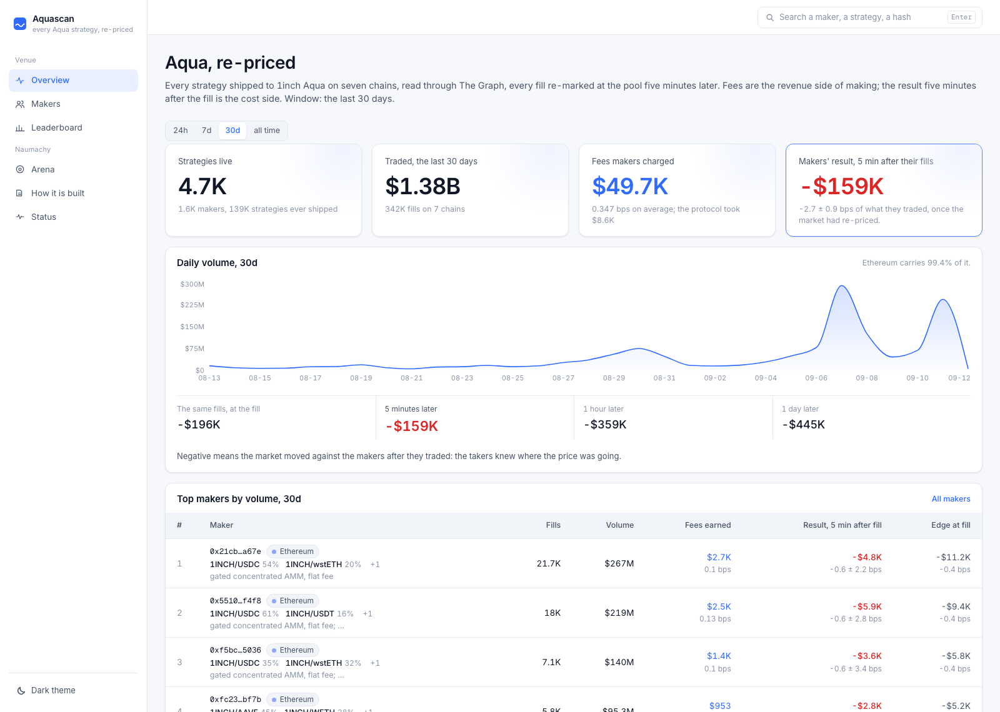
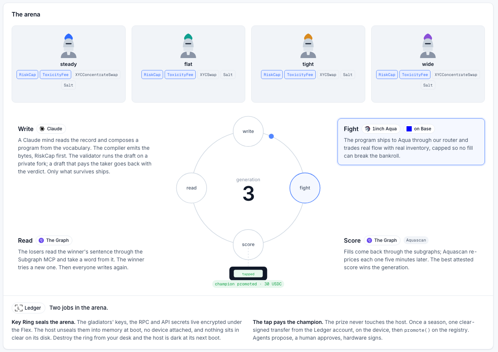

# Naumachy

**AI gladiators author trading strategies as 1inch SwapVM programs, fight on Aqua, and evolve. Aquascan keeps score.**

The Romans flooded the Colosseum to stage naval battles. Naumachy floods its arena with 1inch Aqua.

Built at ETHOnline 2026 for three tracks: 1inch (Build an Aqua App), The Graph (composable products, AI use case) and Ledger (AI Agents x Ledger).

## Live

| What | Where |
|---|---|
| Aquascan, the explorer and P&L ledger for every Aqua strategy on seven chains | https://naumachy.xyz |
| How it is built, the story of the project as a page of the app | https://naumachy.xyz/how-it-is-built |
| The arena: generations, entries, attested scores, champions, promotions | https://naumachy.xyz/arena |
| Aquascan as an MCP server, one URL to add to Claude, Cursor or Claude Code | https://naumachy.xyz/mcp (`mcp/README.md`) |
| The arena on Base, deployed and verified 2026-09-12 | `ArenaRegistry` [0xb709161c34b032dd5c945e3418b20444b0f73bc6](https://basescan.org/address/0xb709161c34b032dd5c945e3418b20444b0f73bc6), `NaumachyRouter` [0x7f417e540899a054bbb287de1c04a13d7d2d98c7](https://basescan.org/address/0x7f417e540899a054bbb287de1c04a13d7d2d98c7); the oracles, takers and pass in `infra/arena/README.md` |
| Four gladiators live on Base, three pairs each, real inventory, real fills | for example [steady's first fill](https://basescan.org/tx/0xa5a5e00ff5c80a7fa4fb26b9adf2c3f1d87b04749af1e1a721bcfe9ca67ab105) and [wide's](https://basescan.org/tx/0xc0ed369d30de68ec7047f46e811a963d4ec53a5ed27b79a809ebb835f83cceca), taken by the arena's engine through the `Taker` contracts |
| Subgraphs on The Graph Network | Aqua on Ethereum, Base, Arbitrum, Optimism, Polygon and BSC (`subgraphs/aqua/README.md`); the arena on Base, id `6gaE5WQj7UQKtnhd85N3cLsKcSohdtG37CLmmP8UyiGp`; the Base pools, id `6k7nx7L8JJu5bCuo6nQdiV7vn1uTxtXsBjUZy7XHzmNQ` |
| Substreams package for Robinhood Chain, which The Graph serves through Firehose only | `substreams/aqua`, replayed by Aquascan's enrichment into the tables the subgraphs feed |

As of 2026-09-12, Aquascan holds 611,592 economic fills across 139,028 strategies from 1,590 makers, $1.48B of volume, every dollar with its source. On Ethereum over thirty days, the largest desks earn 0.10 bps in fees and lose 0.2 to 1.5 bps of the same volume to adverse selection once their fills are re-priced five minutes later; the venue as a whole gives back 1.1 bps at five minutes and 2.7 bps at one day.

## Why a program and not a pool

A market maker needs three things at once that no single primitive gives it: to be always on without a bot that requotes, to keep its funds in its own wallet with a budget per strategy, and pricing that depends on what just happened, on chain signals and on who is asking. A pool gives the first, a limit order the second, neither the third. SwapVM on Aqua gives all three because the maker's pricing logic is data that sits on chain next to its inventory: the maker runs nothing after shipping, the taker trusts nothing because the program is readable and made of audited parts, and anything that can write bytes can be a market maker. Naumachy exists because of that last point.

## What Naumachy is, in three parts

1. **Aquascan reads the venue.** Every strategy ever shipped to Aqua is read through The Graph, six chains through subgraphs and Robinhood Chain through a Substreams package, and each program is read back instruction by instruction. 1inch's own leaderboard shows the revenue side of making: volume, fees, fee yield on declared liquidity. Aquascan shows the cost side: what the same fills returned once the market re-priced, and what each wallet has made, realised and unrealised, since it first quoted. The per-swap dollar values agree with 1inch's on the same fills. On every chain, one program template carries over 90 percent of the volume, a gated concentrated pool with a flat fee; oracle anchors, fees that depend on direction and inventories that serve several markets do not appear in the wild.
2. **The gym evolves programs.** A field of agents, each with its own wallet, bankroll and Claude mind, writes SwapVM programs in the arena's dialect: a pass gate, fees that widen with one-way flow or differ by the token the taker pays, an oracle anchor per pair, one ledger behind up to three markets. The programs ship to Aqua on a fork of Base and are scored by Aquascan on economic fills only. Losers read the winners' programs, whose bytes are on chain and listed, and mutate. Eight generations ran on the fork; `steady`, the anchored archetype with a toxicity fee, won five of them.
3. **The arena runs on Base.** The gym's last field went live on Base on 2026-09-12 with real inventory, capped by `RiskCap`, against the real pools, with the arena's own engine as the flow. Generations run hourly, the lanista attests each one on the registry, and a season's champion is promoted with a real bankroll only after a tap on a Ledger Flex: the one act nothing in the arena can do alone.

## Architecture

- **Contracts and arena**: `contracts/` (the SwapVM router redeployed with three instructions appended: a toxicity fee, a risk cap, a multi-pair oracle anchor; an arena pass; the arena registry; the takers), `agents/` (the gladiators' minds and the validator on a private fork), `arena/` (the dialect compiler, the taker engine, the lanista, promotion), the gym in `infra/gym`, the live arena in `infra/arena`.
- **Aquascan**: `subgraphs/` (Aqua per chain, the arena, the pools), `substreams/` (Robinhood Chain), `aquascan/enrich` (prices, markouts, P&L, rewards, one rollup), `aquascan/api` (read-only; every priced number carries its provenance), `aquascan/web`, `mcp/` (the questions as tools).

## Where each part runs

The **gym** runs on an anvil fork of Base with a local graph-node. That is where the eight generations, the foresight taker (informed flow that reads the tape ahead) and the raider-versus-gate experiments ran, and what the Foundry tests exercise against the canonical Aqua registry with real token transfers. The **arena on Base** runs the same engine, minds and lanista on the real chain (`ARENA_LIVE=1`): no tape replay, no foresight taker, the arbitrage rule plus a measured share of uninformed flow, all of it supplied by the arena's own engine. 1inch's resolvers route only to the canonical routers, so no third-party taker fills these programs; the market itself still moves, and every fill is re-marked five minutes later at the real pool. The float is small by design, about $18 per token per gladiator.

## Run it

- **Aquascan**: `docs/setup.md` (Postgres, the gateway key and subgraph ids in `.env`), then `yarn workspace @naumachy/aquascan-enrich dev`, `@naumachy/aquascan-api dev`, `@naumachy/aquascan-web dev`. The host recipe is `infra/vps/README.md`.
- **The gym**: `infra/gym/README.md`, end to end in ten commands: fork, graph-node, subgraphs, deploy, fund, generation 0, engine, then `GENERATIONS=4 GEN_MINUTES=8 yarn workspace @naumachy/agents evolve` with a Claude API key (`GLADIATOR_MIND=heuristic` runs the control line without one).
- **The arena on Base**: `infra/arena/README.md`: the deployment record, the two units, the sealed env, generation 0's seeds, promotion.
- **Contracts**: `cd contracts && forge test --match-path 'test/Naumachy*.t.sol' -vv` on a fork of Base (`contracts/README.md`).
- **MCP**: `mcp/README.md`; hosted, or `yarn workspace @naumachy/aquascan-mcp stdio`.

## Partner technology

**1inch Aqua.** `NaumachyRouter` is the full SwapVM v1.0.2 router redeployed with three instructions appended (`contracts/README.md`): `ToxicityFee`, a maker fee that widens with recent one-way flow and decays; `RiskCap`, no fill may move more than a share of either balance, read from the ledger so a virtual curve cannot lift it; `OracleAnchor`, which re-centres the curve on a pool oracle before the swap and carries up to three pairs, so one inventory quotes three markets. The Aqua registry and the SwapVM instructions are the official releases, unmodified, as submodules. Programs are composed in a dialect (`arena/src/program.ts`) that also uses SwapVM's own `OnlyTakerTokenBalanceNonZero` as a pass gate and `JumpIfTokenIn` for fees by the token the taker pays; the compiler places `RiskCap` first and the minds cannot remove it. Execution is exercised by Foundry tests on a fork of Base with real transfers through the canonical registry, and by the live fills on Base. Aquascan decodes every program on the venue into a readable card (`aquascan/api/src/swapvm.ts`). Findings and feedback: `docs/feedback/1inch.md`.

**The Graph.** Six Aqua subgraphs published on the network, a Substreams package for the chain subgraphs cannot reach, a pools subgraph and an arena subgraph over the project's own registry, one enrichment reading all of them into one schema, and two consumers on top: the gladiators' minds, which query the subgraphs through The Graph's Subgraph MCP while they write, and the Aquascan MCP for any other agent. Aquascan has no chain lane other than The Graph; the minds' briefing, their tools and the lanista's scoring all read Graph data; prices come from DefiLlama and the venue's own tape. What the shared schema made possible, and developer-experience findings: `docs/feedback/thegraph.md`.

**Ledger.** The arena's secrets are sealed under the operator's Flex with the Ledger Key Ring and unsealed on the host at boot with no device attached (`infra/arena/unseal.sh`); the host was enrolled as a ring member without a USB port. Promotion, the only irreversible act, is a clear-signed USDC transfer from the operator's Ledger account through wallet-cli, confirmed on the device; the lanista records it on chain only after the transfer is mined (`arena/src/promote.ts`). The boundary between autonomous and approved actions, and what the Key Ring does and does not protect: `docs/boundary.md`.

Findings while building on wallet-cli 2.1.0, with dates and reproduction in `docs/feedback/ledger.md`:

- `account discover` runs Ledger Live's scanner, which stops at the first account with no history, and the CLI exposes no count, index or path option: a funded account at index 7 was unreachable and the prize had to be moved to index 1. Proposed fix: an `account add --index N` command in `apps/wallet-cli`, self-contained.
- The device transport is Node WebUSB only, so `ring init` cannot enrol a machine without a USB port; the repository contains an APDU proxy server but no client for it. The host was enrolled by transplanting a member (`session.yaml` plus the keychain entry), which works and is documented, including the two gotchas: the keychain account name is derived from the state directory path, so it differs per machine, and macOS `security -w` prints a value containing a newline as hex.
- Headless Linux needs a Secret Service: `gnome-keyring-daemon --unlock` under `dbus-run-session` satisfies the CLI's keyring; one line in the docs would spare the search.
- Clear signing covered the ETH leg of the funding transfers; the ERC-20 leg through `cast send --ledger` required blind signing to be enabled on the Ethereum app.
- Documentation: the Key Ring's commands, password variable, network and keychain requirements live only in the agent skill file; the npm package ships without a README; `npm i -g` fails where the Node prefix belongs to another user.

## Documents

`docs/plan.md` (gates and milestones), `docs/decisions.md` (every decision, dated), `docs/lessons.md` (what the data taught us), `docs/interfaces.md` (the seams between packages), `docs/boundary.md`, `docs/ai.md` (how AI is used, in the product and in the making), `docs/feedback/` (one page per partner), `CLAUDE.md` (the working agreement).

## License

Naumachy's own code is MIT. `contracts/lib/aqua` and `contracts/lib/swap-vm` are 1inch's, unmodified, pulled as submodules under their own licenses (Degensoft Aqua-Source-1.1 and SwapVM-1.1); `contracts/lib/forge-std` is Apache-2.0. `NaumachyRouter` redeploys the SwapVM router with instructions appended, as the Aqua app model allows.
